

# Dev_Setup
Setup Development Environment

#Assignment: Setting Up Your Developer Environment

#Objective:
This assignment aims to familiarize you with the tools and configurations necessary to set up an efficient developer environment for software engineering projects. Completing this assignment will give you the skills required to set up a robust and productive workspace conducive to coding, debugging, version control, and collaboration.

#Tasks:

1. Select Your Operating System (OS):
   Choose an operating system that best suits your preferences and project requirements. Download and Install Windows 11. https://www.microsoft.com/software-download/windows11
   Steps
•	Affirmed that my computer meets the system requirements.
•	Backed up my data.
•	Created a new tool for windows installation. 
•	Installation path: upgraded by launching setup on the media while running windows 10. 
•	I performed a full upgrade and boot from the media to launch the setup.
Screenshots
 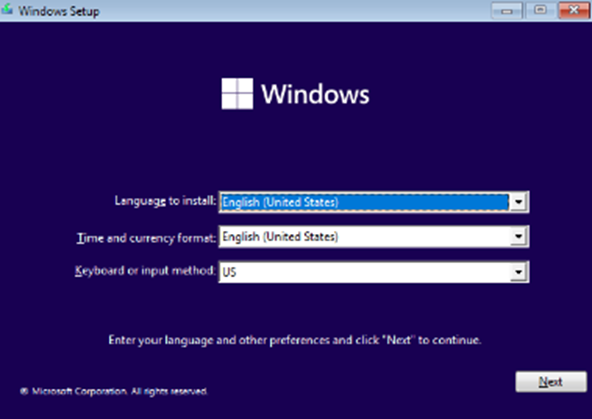
 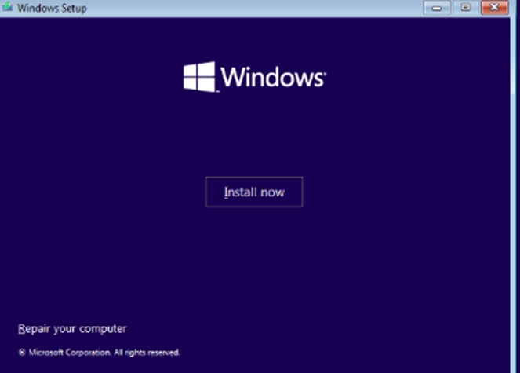
 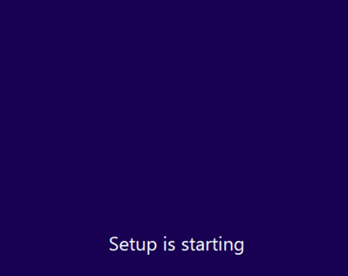
 

 
 
 

2. Install a Text Editor or Integrated Development Environment (IDE):
   Select and install a text editor or IDE suitable for your programming languages and workflow. Download and Install Visual Studio Code. https://code.visualstudio.com/Download
   Steps
•	I navigated to the visual studio code using the link: https://code.visualstudio.com/Download
•	Downloaded the windows 11 x64 system installer.
•	Installed the IDE from the downloads folder. Allowed open with code and add to the path options during the installation.
•	Installed visual studio and opened a new project. 
Screenshots
 ](image-6.png)
 ](image-7.png)
 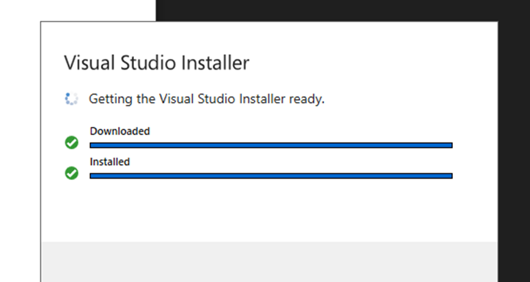
 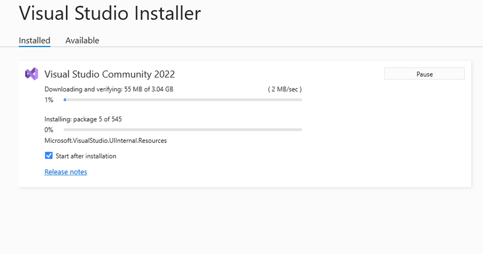
 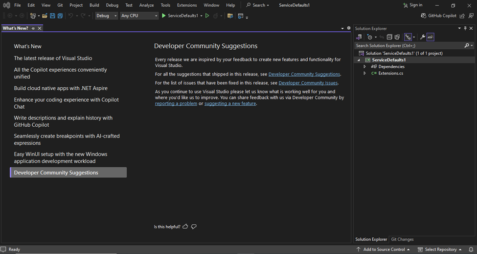
 

 

 

3. Set Up Version Control System:
   Install Git and configure it on your local machine. Create a GitHub account for hosting your repositories. Initialize a Git repository for your project and make your first commit. https://github.com
   Steps
•	Installed GitHub and Gitbash.
•	Created a repository.
•	Added the file “new” into Gitbash
•	Made the first commit
•	Pushed the changes to the repository
Link to new repository: https://github.com/MartinGachuru/new
Screenshots
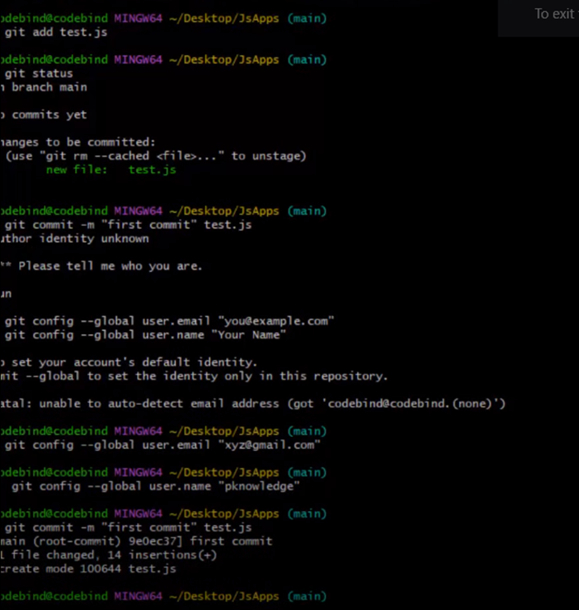
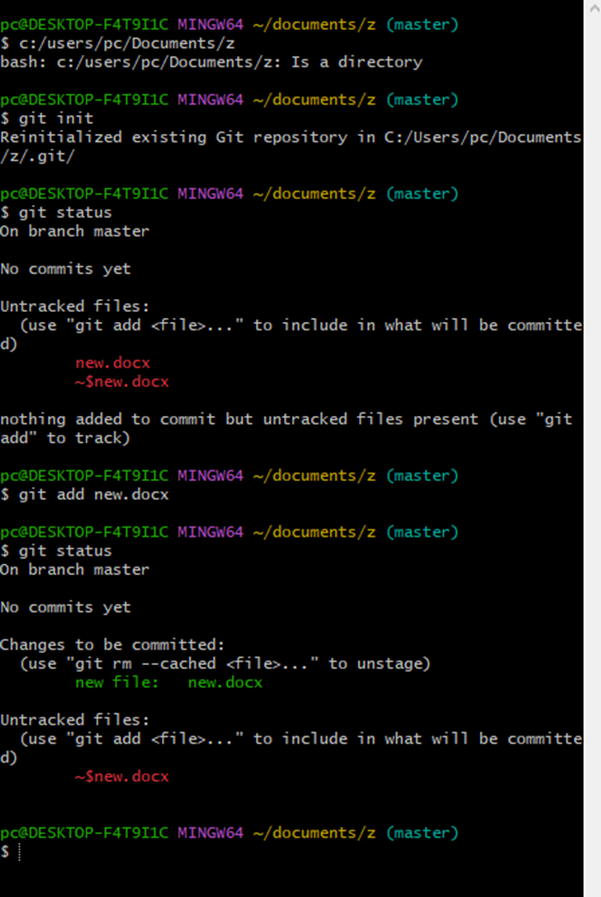

4. Install Necessary Programming Languages and Runtimes:
  Instal Python from http://wwww.python.org programming language required for your project and install their respective compilers, interpreters, or runtimes. Ensure you have the necessary tools to build and execute your code.
Steps
•	Downloaded the latest Python version and ran it.
•	Downloaded the installer and verified the installation
•	Installed the code editor
•	Wrote the first code of python
Screenshots
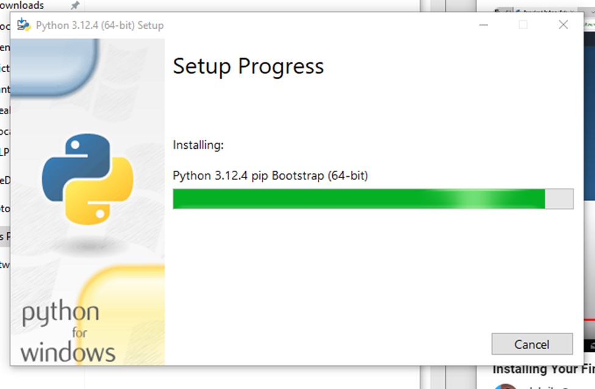
5. Install Package Managers:
   If applicable, install package managers like pip (Python).
Steps
•	Downloaded and installed PIP using the command prompt
•	Code used to download pip: curl https://bootstrap.pypa.io/get-pip.py -o get-pip.py
•	Code for installation: C:\Users\pc>python get-pip.py
Screenshots
Downloading pip in command prompt
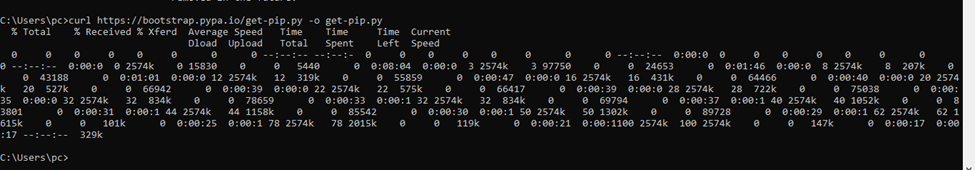
Installing pip
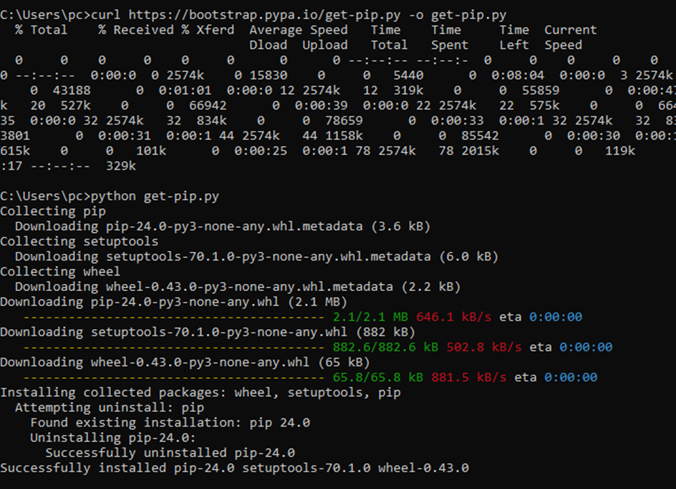
6. Configure a Database (MySQL):
   Download and install MySQL database. https://dev.mysql.com/downloads/windows/installer/5.7.html
   Steps
•	Downloaded MySQL from: https://dev.mysql.com/downloads/windows/installer/5.7.html
•	Configured the servers, created authentication, and configured products. 
Screenshots
MYSQL after installation
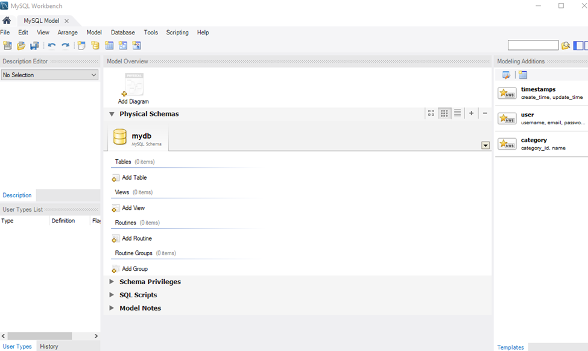

7. Set Up Development Environments and Virtualization (Optional):
   Consider using virtualization tools like Docker or virtual machines to isolate project dependencies and ensure consistent environments across different machines.
Steps
•	Downloaded docker from: https://docs.docker.com/desktop/install/windows-install/#install-docker-desktop-on-windows
•	Installed docker and configured it using the WSL 2 instead of the Hyper-V option.
Screenshots
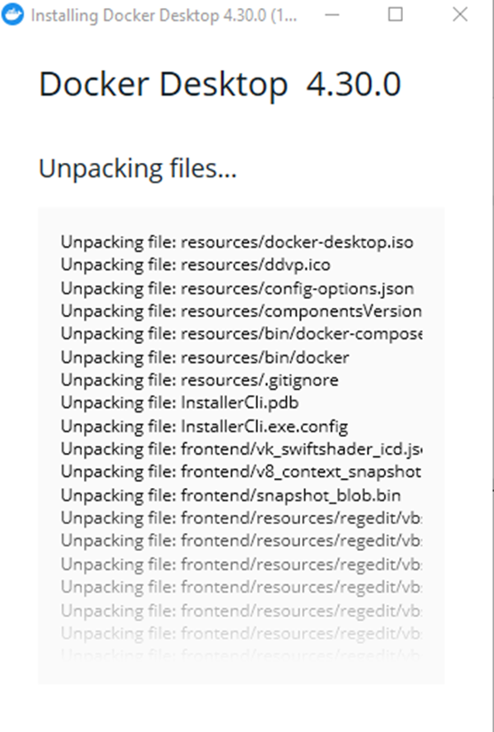
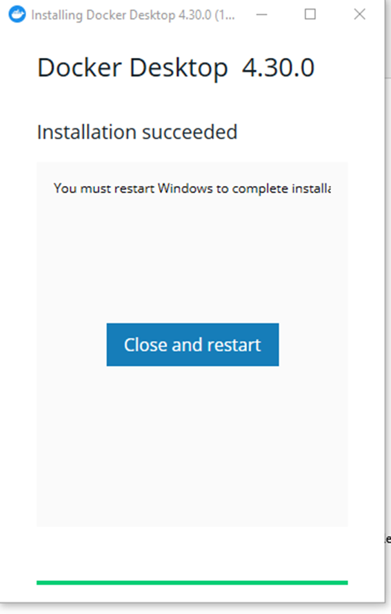
8. Explore Extensions and Plugins:
   Explore available extensions, plugins, and add-ons for your chosen text editor or IDE to enhance functionality, such as syntax highlighting, linting, code formatting, and version control integration.
   Steps
Added the extensions from IDE>extensions
Added code runner, GraphQL for syntax highlighting, learn linting for linting, Formatting toggle for code formatting, and Github actions sidebar for version integration as shown below.
Screenshots
Code runner
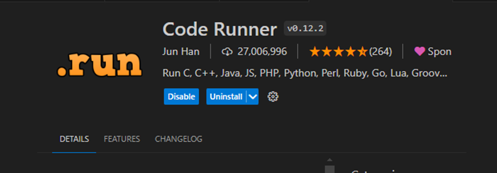
Syntax highlighting 
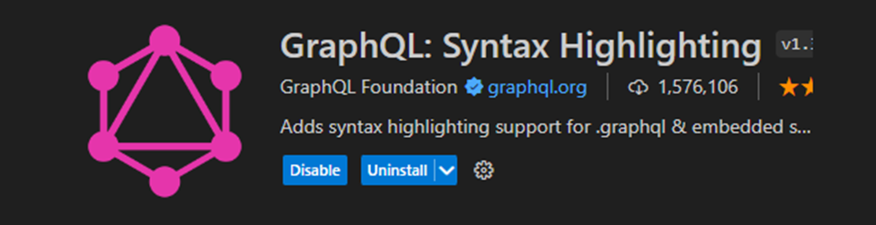
Learn-linting
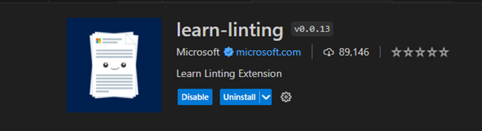
Code formatting
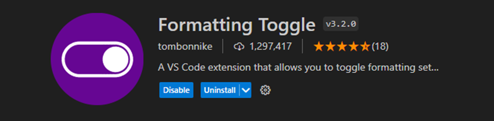
Version control formatting
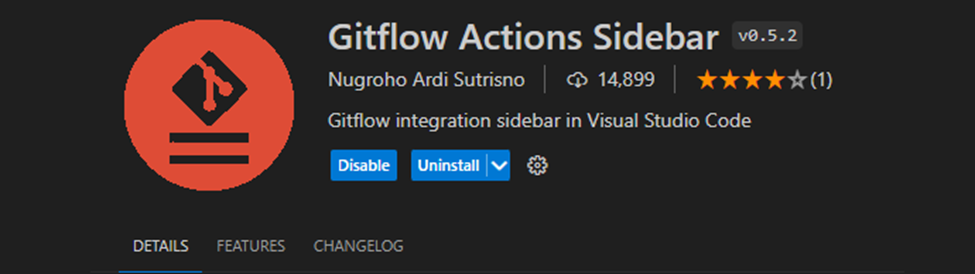
9. Document Your Setup:
    Create a comprehensive document outlining the steps you've taken to set up your developer environment. Include any configurations, customizations, or troubleshooting steps encountered during the process. 
The final developer environment was efficient for functionality such as running codes or creating databases in MySQL. The individual customization and configuration is described in each of the steps.
Challenges and solutions
•	Slow internet speed
I had to wait for the huge size of downloads. 
•	Inaccurate path setting
I had to change the path settings under the environment variables. 
•	Inaccurate codes
I revised the execution codes to write them accurately.

#Deliverables:
- Document detailing the setup process with step-by-step instructions and screenshots where necessary.
- A GitHub repository containing a sample project initialized with Git and any necessary configuration files (e.g., .gitignore).
- A reflection on the challenges faced during setup and strategies employed to overcome them.

#Submission:
Submit your document and GitHub repository link through the designated platform or email to the instructor by the specified deadline.

#Evaluation Criteria:**
- Completeness and accuracy of setup documentation.
- Effectiveness of version control implementation.
- Appropriateness of tools selected for the project requirements.
- Clarity of reflection on challenges and solutions encountered.
- Adherence to submission guidelines and deadlines.

Note: Feel free to reach out for clarification or assistance with any aspect of the assignment.

[def]: image-1.png